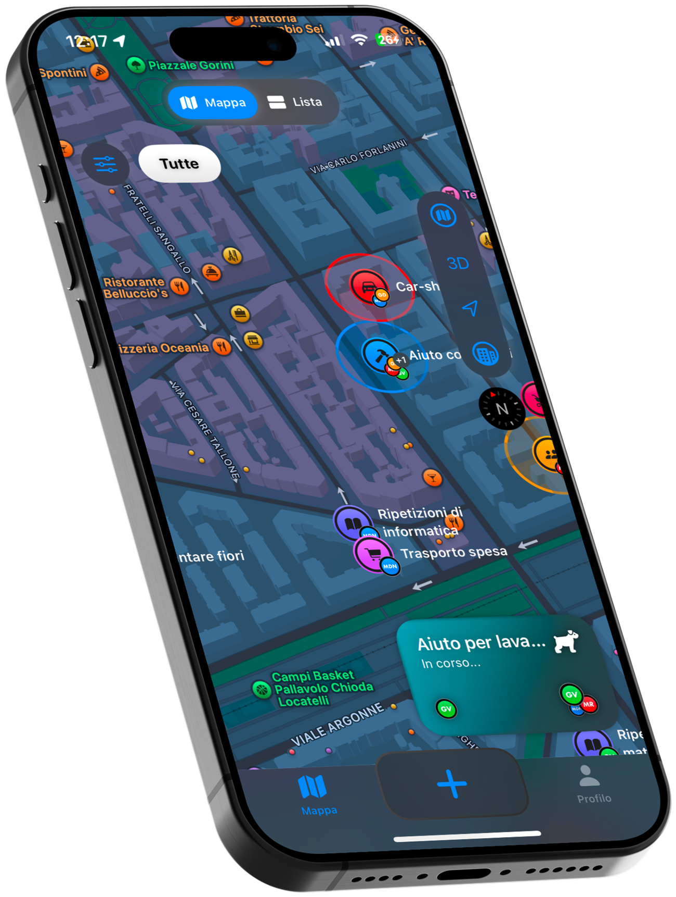

# Time2Help
Progetto di Fondamenti di Human-Computer Interaction - PoliMi a.a. 2024/2025

<a href="https://summacristian.github.io/Progetto_HCI" target="_blank" style="display: inline-block; padding: 10px 20px; background-color:rgb(42, 75, 184); color: white; text-align: center; text-decoration: none; border-radius: 5px; font-weight: bold;">
  🌐 Visualizza nel sito
</a>

## Tema del progetto
### Urban Well-being
> Ideare e progettare una soluzione interattiva per promuovere
**il benessere mentale, fisico e sociale dei cittadini**,
favorendo uno stile di vita equilibrato e sostenibile

Tra le possibili aree si è scelta quella denominata **Relazione/Connessione sociale**, che risponde al problema:
> Come aiutare le persone a creare nuove relazioni sane e forti, cercando di superare attriti e barriere sociali?

## Descrizione

  

    <strong>Time2Help</strong> è un'applicazione mobile per iOS, progettata per permettere agli abitanti di un quartiere di creare una sorta di comunità digitale, dove è possibile scambiarsi Favori in una rete di aiuto reciproco.  
    Time2Help offre una piattaforma dove gli utenti possono richiedere un Favore quando ne hanno necessità, e dove possono scoprire i Favori richiesti da altri utenti, potendo conoscere in anticipo il luogo, il tipo, la durata e l'orario di questo Favore, in modo da poter bilanciare la volontà di aiutare gli altri e di contribuire alla vita di quartiere con gli impegni della propria vita privata.
  

  

## Fasi del Progetto
Lo svolgimento del progetto è stato eseguito in 6 consegne intermedie, più una presentazione finale.
Ognuna di queste consegne è stata oggetto di valutazione, e rappresenta l'esecuzione di una delle varie fasi di progettazione <i>user-centered</i>.

### 1. Needfinding

  

Come prima fase del progetto abbiamo condotto interviste con i nostri utenti target per eseguire un processo di "needfinding".  
Questo processo ha permesso di identificare le difficoltà nello svolgere attività di volontariato e nell'avere fiducia delle persone che vivono nel proprio quartiere.

  

<a href="https://github.com/SummaCristian/Progetto_HCI/tree/main/Consegna%201" target="_blank" style="display: inline-block; padding: 10px 20px; background-color:rgb(42, 75, 184); color: white; text-align: center; text-decoration: none; border-radius: 5px; font-weight: bold;">
  📂 Apri la cartella
</a>

### 2. Raffinamento e focus

  

In questa seconda fase abbiamo svolto una dettagliata revisione delle interviste condotte, cercando punti chiave che emergevano dai racconti degli intervistati.  
Questo ha consentito di analizzare e capire meglio i bisogni delle persone nell'ambito del volontariato e dell'aiuto reciproco all'interno della propria comunità di quartiere.

  

<a href="https://github.com/SummaCristian/Progetto_HCI/tree/main/Consegna%202" target="_blank" style="display: inline-block; padding: 10px 20px; background-color:rgb(42, 75, 184); color: white; text-align: center; text-decoration: none; border-radius: 5px; font-weight: bold;">
  📂 Apri la cartella
</a>

### 3. Task, storyboard e primi prototipi

  

Il team ha svolto vari brainstorming per capire quali fossero i principali bisogni degli utenti, ricercandone 3 di difficoltà crescente, per poi rappresentarli in uno storyboard.  
In questa fase è iniziata anche la fase di prototipazione per la nostra soluzione ai task: abbiamo elaborato 2 modelli iniziali che rappresentassero le funzionalità legate ai task trovati, per poi selezionarne solo uno dei 2.

  

<a href="https://github.com/SummaCristian/Progetto_HCI/tree/main/Consegna%203" target="_blank" style="display: inline-block; padding: 10px 20px; background-color:rgb(42, 75, 184); color: white; text-align: center; text-decoration: none; border-radius: 5px; font-weight: bold;">
  📂 Apri la cartella
</a>

### 4. Raffinamento del prototipo

  

Abbiamo perfezionato il prototipo scelto, sviluppando un prototipo mid-fidelity in Figma che rispecchiasse i bisogni dell'utente e rispecchiasse una buona esperienza d'uso generale.  
Abbiamo in seguito creato 2 file: uno contenente le informazioni per i valutatori esterni (in quanto la consegna successiva riguarda la valutazione del nostro prototipo da parte di un altro team), l'altro contentente la descrizione dell'utilizzo del prototipo e le scelte di design fatte.

  

<a href="https://github.com/SummaCristian/Progetto_HCI/tree/main/Consegna%204" target="_blank" style="display: inline-block; padding: 10px 20px; background-color:rgb(42, 75, 184); color: white; text-align: center; text-decoration: none; border-radius: 5px; font-weight: bold;">
  📂 Apri la cartella
</a>

### 5. Valutazione euristica

  

Ci è stato assegnato un prototipo di un altro gruppo e di questo ne abbiamo fatto la valutazione secondo le 10 euristiche di Nielsen.  
Abbiamo condotto in prima fase una valutazione individuale, evidenziando eventuali suggerimenti per correggere gli errori, per poi compiere un'analisi di gruppo e raccogliere i problemi comuni riscontrati.

  

<a href="https://github.com/SummaCristian/Progetto_HCI/tree/main/Consegna%205" target="_blank" style="display: inline-block; padding: 10px 20px; background-color:rgb(42, 75, 184); color: white; text-align: center; text-decoration: none; border-radius: 5px; font-weight: bold;">
  📂 Apri la cartella
</a>

### 6. Usability testing e prototipo High Fidelity

  

Abbiamo completato il Prototipo in seguito ai risultati della Valutazione Euristica, e abbiamo poi testato l'efficacia della nostra interfaccia chiedendo a 7 utenti di eseguire uno <i>Usability Testing</i>.

  

<a href="https://github.com/SummaCristian/Progetto_HCI/tree/main/Consegna%206" target="_blank" style="display: inline-block; padding: 10px 20px; background-color:rgb(42, 75, 184); color: white; text-align: center; text-decoration: none; border-radius: 5px; font-weight: bold;">
  📂 Apri la cartella
</a>

## Prototipi

  <a href="https://www.figma.com/design/n5gxp4iFehx6jtxsdxqUNH/Time2Help---Imagineers?node-id=0-1&t=hDIK9T7nilFLDCcu-1" target="_blank" style="display: flex; flex-direction: column; align-items: center; padding: 10px 20px; background-color: rgba(42, 75, 184, 0.3); color: white; text-align: center; text-decoration: none; border-radius: 25px; font-weight: bold; width: 180px">
    
    
Prototipo Figma

  </a>

  <a href="https://github.com/SummaCristian/Progetto_HCI_iOS" target="_blank" style="display: flex; flex-direction: column; align-items: center; padding: 10px 20px; background-color: rgba(199, 79, 32, 0.3); color: white; text-align: center; text-decoration: none; border-radius: 25px; font-weight: bold; width: 180px;">
    
    
Prototipo Swift

  </a>

## Gruppo
### Nome del gruppo
Questo progetto è stato realizzato dal gruppo <b><i>Imagineers</i></b>.
### Componenti
<table style="width: 100%; border-collapse: collapse;">
  <tr>
    <td style="text-align: center; padding: 10px;">
      
    </td>
    <td style="text-align: center; padding: 10px;">
      <b><a href="https://github.com/mattiaDina" style="text-decoration: none; color: black;">mattiaDina</a></b>
    </td>
    <td style="text-align: center; padding: 10px;">
      Mattia Di Nardo
    </td>
  </tr>
  <tr>
    <td style="text-align: center; padding: 10px;">
      
    </td>
    <td style="text-align: center; padding: 10px;">
      <b><a href="https://github.com/Mailp99" style="text-decoration: none; color: black;">Mailp99</a></b>
    </td>
    <td style="text-align: center; padding: 10px;">
      Mathias Rodigari
    </td>
  </tr>
  <tr>
    <td style="text-align: center; padding: 10px;">
      
    </td>
    <td style="text-align: center; padding: 10px;">
      <b><a href="https://github.com/RaffaeleRossi101102" style="text-decoration: none; color: black;">RaffaeleRossi101102</a></b>
    </td>
    <td style="text-align: center; padding: 10px;">
      Raffaele Rossi
    </td>
  </tr>
  <tr>
    <td style="text-align: center; padding: 10px;">
      
    </td>
    <td style="text-align: center; padding: 10px;">
      <b><a href="https://github.com/ilaria-18" style="text-decoration: none; color: black;">ilaria-18</a></b>
    </td>
    <td style="text-align: center; padding: 10px;">
      Ilaria Sala
    </td>
  </tr>
  <tr>
    <td style="text-align: center; padding: 10px;">
      
    </td>
    <td style="text-align: center; padding: 10px;">
      <b><a href="https://github.com/SummaCristian" style="text-decoration: none; color: black;">SummaCristian</a></b>
    </td>
    <td style="text-align: center; padding: 10px;">
      Cristian Summa
    </td>
  </tr>
  <tr>
    <td style="text-align: center; padding: 10px;">
      
    </td>
    <td style="text-align: center; padding: 10px;">
      <b><a href="https://github.com/Bea315" style="text-decoration: none; color: black;">Bea315</a></b>
    </td>
    <td style="text-align: center; padding: 10px;">
      Beatrice Tenti
    </td>
  </tr>
  <tr>
    <td style="text-align: center; padding: 10px;">
      
    </td>
    <td style="text-align: center; padding: 10px;">
      <b><a href="https://github.com/gaiavizza" style="text-decoration: none; color: black;">gaiavizza</a></b>
    </td>
    <td style="text-align: center; padding: 10px;">
      Gaia Vizza
    </td>
  </tr>
</table>
